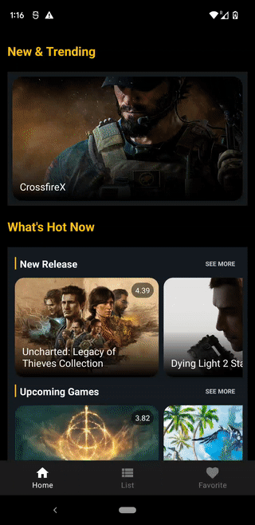

### Alan's ongoing personal project #3 ~~(WIP)~~ 
### ~~- Target date (release)~~
~~Feb 19, 2022~~
 

The original plan to build this application was to release an app that introduces game information and shares reviews based on jetpack compose. However, in my personal opinion, I felt it was still a bit early to apply compose to apps intended for official release rather than demo apps. I still have to use ExpreimentalApi, and I've realized that there were many cases where problems were solved with workarounds rather than best practices in terms of UI implementation. Threrfore, I'm going to discontinue this project and goint to implement this game app again with the existing XML way.

 
 
 

| Main Screen | List Screen | Detail Screen |
| :---------------: | :---------------: | :---------------: |
| |  | |

</pr>
 

### - Teck stack
- Clean architecture(multi module) with MVVM pattern 
- Kotlin 
- Coroutines 
- Jetpack Compose 
- Hilt 
- retrofit, room  
- Coil, Timber,    

### - Issues to be fixed
- API 
: too slow api response 
: limitaion of req based on free account 
: unstable server

### - Further development
- code optimization 
: need to take full advantage of reusability and State hoisting.

- backend 
: build backend using Firebase(caching data from RAWG api)to deal with req limiation issue and slow api response issue

- Features 
: Review, Favorite

